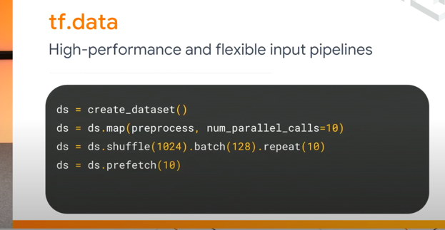
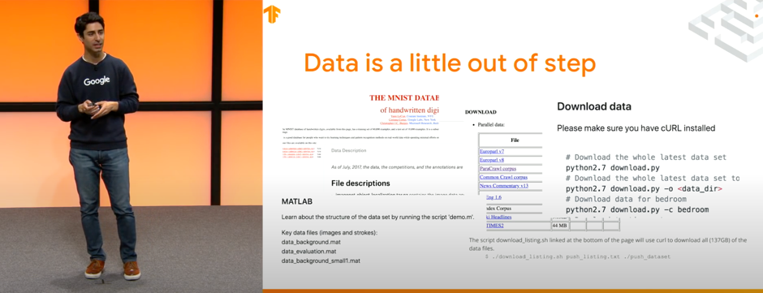
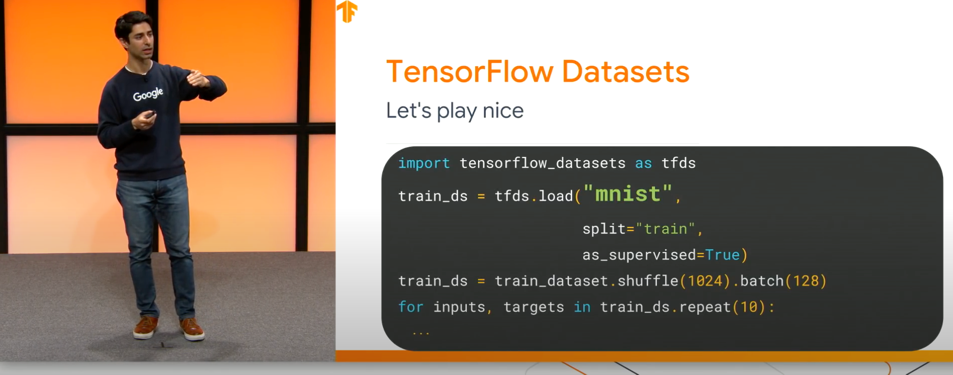

# Notes

## tfds
### What?

> a collection of ready-to-use datasets.

2019년 상반기 TF Dev submit에서 처음 소개된 데이터 로드 라이브러리.


### Why?

slide | 설명
---| --- |
| `tf.data`를 활용해서 유연한 파이프라인이 가능했지만
| 데이터 자체에는 통일성이 없다. MNIST, IMDB - 다 조금씩 다르다.

새로운 데이터가 published 될 때 마다, 서로 조금씩 다른 포맷으로 나온다. 때문에 `tf.data` 파이프라인으로 데이터를 
조작하기 위해선 데이터 셋 별로 전처리를 매번 해주어야 한다.

데이터를 publish하는 포맷을 `tf.data` 파이프라인을 연결하기 쉽도록 하는 하나의 포맷으로 통일해버리면 어떨까? -> tensorflow_datasets.

요약을 하자면:
> Datasets are distributed in all kinds of formats and in all kinds of places, 
>and they're not always stored in a format that's ready to feed into a machine learning pipeline. Enter TFDS.


### How?
#### 사용가능한 데이터 셋 확인
```python
pp = pprint.PrettyPrinter(indent=4)
    # https://www.tensorflow.org/datasets/overview#find_available_datasets
    print("### find available datasets ###")
    builders: List[str] = tfds.list_builders()
    pp.pprint(builders)
```
```
[   'abstract_reasoning',
    'aeslc',
    'aflw2k3d',
    'ag_news_subset',
    'ai2_arc',
    'ai2_arc_with_ir',
    'amazon_us_reviews',
    'anli',
    'arc',
    'bair_robot_pushing_small',
    'bccd',
    'beans,
     ...,
]
```

### 원하는 데이터 셋 로드


slide | 설명
--- | ---|
 | `tfds.load`로 데이터를 지정하고, 어떤 포맷으로 나오길 바라는지 지정할 수 있다. 

`tf.load` hides all the complexity.

dataset 공식 문서를 확인해보면:

<ul>
<li><code translate="no" dir="ltr">split=</code>: Which split to read (e.g. <code translate="no" dir="ltr">'train'</code>, <code translate="no" dir="ltr">['train', 'test']</code>, <code translate="no" dir="ltr">'train[80%:]'</code>,...). See our <a href="https://www.tensorflow.org/datasets/splits">split API guide</a>.</li>
<li><code translate="no" dir="ltr">shuffle_files=</code>: Control whether to shuffle the files between each epoch (TFDS store big datasets in multiple smaller files).</li>
<li><code translate="no" dir="ltr">data_dir=</code>: Location where the dataset is saved (
defaults to <code translate="no" dir="ltr">~/tensorflow_datasets/</code>)</li>
<li><code translate="no" dir="ltr">with_info=True</code>: Returns the <a href="https://www.tensorflow.org/datasets/api_docs/python/tfds/core/DatasetInfo"><code translate="no" dir="ltr">tfds.core.DatasetInfo</code></a> containing dataset metadata</li>
<li><code translate="no" dir="ltr">download=False</code>: Disable download</li>
</ul>

### 직접 만든 데이터 셋을 업로드

[공식 Instructions](https://www.tensorflow.org/datasets/add_dataset)에 따라 직접 자신의 데이터 셋을
전처리해서 distribute 할 수 있다.


## References
- [공식 doc](https://www.tensorflow.org/datasets)
- [TensorFlow Datasets (TF Dev Summit '19)](https://www.youtube.com/watch?v=-nTe44WT0ZI)
- [공식 tutorial](https://www.tensorflow.org/datasets/overview#load_a_dataset)