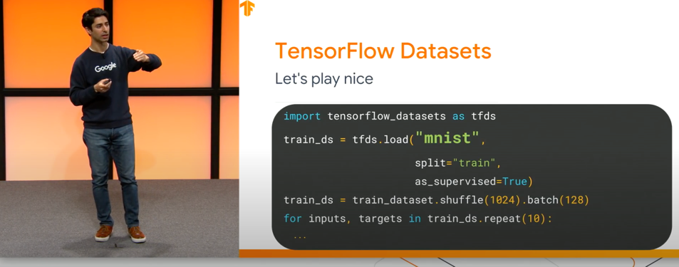

# setup input pipeline

## the goal
1. Use TFDS to load the Portugese-English translation dataset from the TED Talks Open Translation Project.
2. Create a custom subwords tokenizer from the training dataset.
3. Add a start and end token to the input and target.

## concepts
### tfds (tensorflow datasets)

#### What?

> a collection of ready-to-use datasets.

2019년 상반기 TF Dev submit에서 처음 소개된 데이터 로드 라이브러리.
readme

#### Why?

slide|설명
---|---|
| `tf.data`를 활용해서 유연한 파이프라인이 가능했지만
| 데이터 자체에는 통일성이 없다. MNIST, IMDB - 다 조금씩 다르다.

새로운 데이터가 published 될 때 마다, 서로 조금씩 다른 포맷으로 나온다. 때문에 `tf.data` 파이프라인으로 데이터를
조작하기 위해선 데이터 셋 별로 전처리를 매번 해주어야 한다.

데이터를 publish하는 포맷을 `tf.data` 파이프라인을 연결하기 쉽도록 하는 하나의 포맷으로 통일해버리면 어떨까? -> tensorflow_datasets.

요약을 하자면:
> Datasets are distributed in all kinds of formats and in all kinds of places,
>and they're not always stored in a format that's ready to feed into a machine learning pipeline. Enter TFDS.

#### How?

##### 사용가능한 데이터 셋 확인
[`tfds.list_builders`](https://www.tensorflow.org/datasets/overview#find_available_datasets) 를 
통해 이용 가능한 데이터 셋을 리스트로 간단하게 확인해볼 수 있음.

##### 원하는 데이터 셋 로드

slide | 설명
--- | ---|
 | `tfds.load`로 데이터를 지정하고, 어떤 포맷으로 나오길 바라는지 지정할 수 있다.

[`tfds.load` API](https://www.tensorflow.org/datasets/api_docs/python/tfds/load) 문서에서 
자세한 방법 확인해보기. 문서가 정말 잘 쓰여있다.
 
 
##### 직접 만든 데이터 셋을 업로드

직접 구축한 데이터가 있다면, [tensorflow_datasets 에서 제공하는 가이드](https://www.tensorflow.org/datasets/add_dataset) 를 따라 통일된 포맷으로 전처리를 해서
다른 사람들도 사용할 수 있도록 배포할 수 있다.

