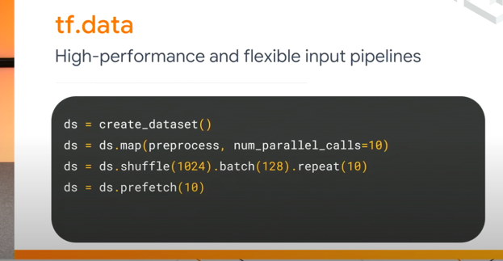
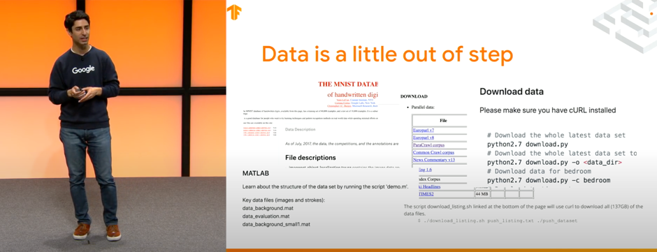

# setup input pipeline

## the goal
1. Use TFDS to load the Portugese-English translation dataset from the TED Talks Open Translation Project.
2. Create a custom subwords tokenizer from the training dataset.
3. Add a start and end token to the input and target.
4. preprocess the training set.
   - filer long sentences
   - encode with the tokenizers
   - shuffle
   - padded batch
   - prefetch


## concepts
### tfds (tensorflow datasets)

#### What?

> a collection of ready-to-use datasets.

2019년 상반기 TF Dev submit에서 처음 소개된 데이터 로드 라이브러리.
readme

#### Why?

slide|설명
---|---|
| `tf.data`를 활용해서 유연한 파이프라인이 가능했지만
| 데이터 자체에는 통일성이 없다. MNIST, IMDB - 다 조금씩 다르다.

새로운 데이터가 published 될 때 마다, 서로 조금씩 다른 포맷으로 나온다. 때문에 `tf.data` 파이프라인으로 데이터를
조작하기 위해선 데이터 셋 별로 전처리를 매번 해주어야 한다.

데이터를 publish하는 포맷을 `tf.data` 파이프라인을 연결하기 쉽도록 하는 하나의 포맷으로 통일해버리면 어떨까? -> tensorflow_datasets.

요약을 하자면:
> Datasets are distributed in all kinds of formats and in all kinds of places,
>and they're not always stored in a format that's ready to feed into a machine learning pipeline. Enter TFDS.


#### How?

##### 사용가능한 데이터 셋 확인
[`tfds.list_builders`](https://www.tensorflow.org/datasets/overview#find_available_datasets) 를 
통해 이용 가능한 데이터 셋을 리스트로 간단하게 확인해볼 수 있음.


##### 원하는 데이터 셋 로드

slide | 설명
--- | ---|
 | `tfds.load`로 데이터를 지정하고, 어떤 포맷으로 나오길 바라는지 지정할 수 있다.

[`tfds.load` API](https://www.tensorflow.org/datasets/api_docs/python/tfds/load) 문서에서 
자세한 방법 확인해보기. 문서가 정말 잘 쓰여있다.
 
 
##### 직접 만든 데이터 셋을 업로드

직접 구축한 데이터가 있다면, [tensorflow_datasets 에서 제공하는 가이드](https://www.tensorflow.org/datasets/add_dataset) 를 따라 통일된 포맷으로 전처리를 해서
다른 사람들도 사용할 수 있도록 배포할 수 있다.


## script output
```text
### looking up available datasets ###
[   'abstract_reasoning',
    'aeslc',
    'aflw2k3d',
    'ag_news_subset',
    'ai2_arc',
    'ai2_arc_with_ir',
    'amazon_us_reviews',
    'anli',
    'arc',
    'bair_robot_pushing_small',
    'bccd',
    'beans',
    'big_patent',
    'bigearthnet',
    'billsum',
    'binarized_mnist',
    'binary_alpha_digits',
    'blimp',
    'bool_q',
    'c4',
    'caltech101',
    'caltech_birds2010',
    'caltech_birds2011',
    'cars196',
    'cassava',
    'cats_vs_dogs',
    'celeb_a',
    'celeb_a_hq',
    'cfq',
    'chexpert',
    'cifar10',
    'cifar100',
    'cifar10_1',
    'cifar10_corrupted',
    'citrus_leaves',
    'cityscapes',
    'civil_comments',
    'clevr',
    'clic',
    'clinc_oos',
    'cmaterdb',
    'cnn_dailymail',
    'coco',
    'coco_captions',
    'coil100',
    'colorectal_histology',
    'colorectal_histology_large',
    'common_voice',
    'coqa',
    'cos_e',
    'cosmos_qa',
    'covid19sum',
    'crema_d',
    'curated_breast_imaging_ddsm',
    'cycle_gan',
    'deep_weeds',
    'definite_pronoun_resolution',
    'dementiabank',
    'diabetic_retinopathy_detection',
    'div2k',
    'dmlab',
    'downsampled_imagenet',
    'dsprites',
    'dtd',
    'duke_ultrasound',
    'emnist',
    'eraser_multi_rc',
    'esnli',
    'eurosat',
    'fashion_mnist',
    'flic',
    'flores',
    'food101',
    'forest_fires',
    'fuss',
    'gap',
    'geirhos_conflict_stimuli',
    'genomics_ood',
    'german_credit_numeric',
    'gigaword',
    'glue',
    'goemotions',
    'gpt3',
    'groove',
    'gtzan',
    'gtzan_music_speech',
    'higgs',
    'horses_or_humans',
    'i_naturalist2017',
    'imagenet2012',
    'imagenet2012_corrupted',
    'imagenet2012_real',
    'imagenet2012_subset',
    'imagenet_a',
    'imagenet_r',
    'imagenet_resized',
    'imagenet_v2',
    'imagenette',
    'imagewang',
    'imdb_reviews',
    'irc_disentanglement',
    'iris',
    'kitti',
    'kmnist',
    'lfw',
    'librispeech',
    'librispeech_lm',
    'libritts',
    'ljspeech',
    'lm1b',
    'lost_and_found',
    'lsun',
    'malaria',
    'math_dataset',
    'mctaco',
    'mnist',
    'mnist_corrupted',
    'movie_lens',
    'movie_rationales',
    'movielens',
    'moving_mnist',
    'multi_news',
    'multi_nli',
    'multi_nli_mismatch',
    'natural_questions',
    'newsroom',
    'nsynth',
    'nyu_depth_v2',
    'omniglot',
    'open_images_challenge2019_detection',
    'open_images_v4',
    'openbookqa',
    'opinion_abstracts',
    'opinosis',
    'opus',
    'oxford_flowers102',
    'oxford_iiit_pet',
    'para_crawl',
    'patch_camelyon',
    'paws_wiki',
    'paws_x_wiki',
    'pet_finder',
    'pg19',
    'places365_small',
    'plant_leaves',
    'plant_village',
    'plantae_k',
    'qa4mre',
    'qasc',
    'quickdraw_bitmap',
    'radon',
    'reddit',
    'reddit_disentanglement',
    'reddit_tifu',
    'resisc45',
    'robonet',
    'rock_paper_scissors',
    'rock_you',
    'salient_span_wikipedia',
    'samsum',
    'savee',
    'scan',
    'scene_parse150',
    'scicite',
    'scientific_papers',
    'sentiment140',
    'shapes3d',
    'smallnorb',
    'snli',
    'so2sat',
    'speech_commands',
    'spoken_digit',
    'squad',
    'stanford_dogs',
    'stanford_online_products',
    'starcraft_video',
    'stl10',
    'sun397',
    'super_glue',
    'svhn_cropped',
    'ted_hrlr_translate',
    'ted_multi_translate',
    'tedlium',
    'tf_flowers',
    'the300w_lp',
    'tiny_shakespeare',
    'titanic',
    'trec',
    'trivia_qa',
    'tydi_qa',
    'uc_merced',
    'ucf101',
    'vctk',
    'vgg_face2',
    'visual_domain_decathlon',
    'voc',
    'voxceleb',
    'voxforge',
    'waymo_open_dataset',
    'web_questions',
    'wider_face',
    'wiki40b',
    'wikihow',
    'wikipedia',
    'wikipedia_toxicity_subtypes',
    'wine_quality',
    'winogrande',
    'wmt14_translate',
    'wmt15_translate',
    'wmt16_translate',
    'wmt17_translate',
    'wmt18_translate',
    'wmt19_translate',
    'wmt_t2t_translate',
    'wmt_translate',
    'wordnet',
    'xnli',
    'xquad',
    'xsum',
    'yelp_polarity_reviews',
    'yes_no']

### the first 5 elements of train_ex ###
INFO:absl:Load dataset info from /Users/eubin/tensorflow_datasets/ted_hrlr_translate/pt_to_en/1.0.0
INFO:absl:Reusing dataset ted_hrlr_translate (/Users/eubin/tensorflow_datasets/ted_hrlr_translate/pt_to_en/1.0.0)
INFO:absl:Constructing tf.data.Dataset for split None, from /Users/eubin/tensorflow_datasets/ted_hrlr_translate/pt_to_en/1.0.0
2020-10-08 11:55:48.631431: I tensorflow/core/platform/cpu_feature_guard.cc:142] This TensorFlow binary is optimized with oneAPI Deep Neural Network Library (oneDNN)to use the following CPU instructions in performance-critical operations:  AVX2 FMA
To enable them in other operations, rebuild TensorFlow with the appropriate compiler flags.
2020-10-08 11:55:48.642572: I tensorflow/compiler/xla/service/service.cc:168] XLA service 0x7f8f5ceb6f80 initialized for platform Host (this does not guarantee that XLA will be used). Devices:
2020-10-08 11:55:48.642583: I tensorflow/compiler/xla/service/service.cc:176]   StreamExecutor device (0): Host, Default Version
[   (   b'e quando melhoramos a procura , tiramos a \xc3\xbanica vantagem da'
        b' impress\xc3\xa3o , que \xc3\xa9 a serendipidade .',
        b'and when you improve searchability , you actually take away the one '
        b'advantage of print , which is serendipity .'),
    (   b'mas e se estes fatores fossem ativos ?',
        b'but what if it were active ?'),
    (   b'mas eles n\xc3\xa3o tinham a curiosidade de me testar .',
        b"but they did n't test for curiosity ."),
    (   b'e esta rebeldia consciente \xc3\xa9 a raz\xc3\xa3o pela qual eu , co'
        b'mo agn\xc3\xb3stica , posso ainda ter f\xc3\xa9 .',
        b'and this conscious defiance is why i , as an agnostic , can still ha'
        b've faith .'),
    (   b"`` `` '' podem usar tudo sobre a mesa no meu corpo . ''",
        b'you can use everything on the table on me .')]

### testing the english tokenizer ###
INFO:create_subwords_tokenizer:tokenizer_pt has been loaded from cache
INFO:create_subwords_tokenizer:tokenizer_en has been loaded from cache
Sample string: Transformer is awesome
Encoded string: [7915, 1248, 7946, 7194, 13, 2799]

### if a word does not exist in vocab, it is tokenized into subwords ###
7915 ----> T
1248 ----> ran
7946 ----> s
7194 ----> former 
13 ----> is 
2799 ----> awesome

### the first 5 elements of the preprocessed training set ###
(   array([[8214,   52, 6472, ...,    0,    0,    0],
       [8214,    6,    3, ...,    0,    0,    0],
       [8214,    7, 6801, ...,  395,    2, 8215],
       ...,
       [8214,  442,   20, ...,    0,    0,    0],
       [8214,   11,   55, ...,    0,    0,    0],
       [8214,   72,   31, ...,    0,    0,    0]]),
    array([[8087,   17, 5262, ...,    0,    0,    0],
       [8087,    4,    3, ...,    0,    0,    0],
       [8087,    3, 6174, ..., 6095,    2, 8088],
       ...,
       [8087,   12,  198, ...,    0,    0,    0],
       [8087,   23,    5, ...,    0,    0,    0],
       [8087,   17,  114, ...,    0,    0,    0]]))

```